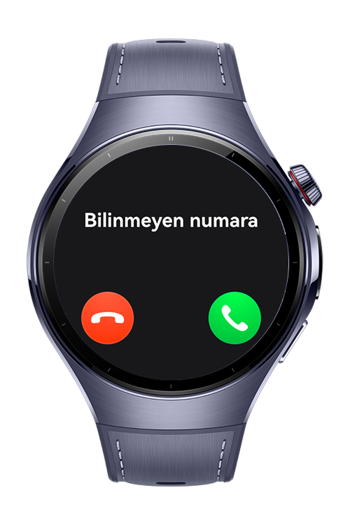
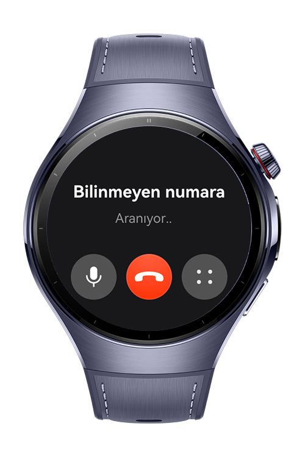

> **Note:** To access all shared projects, get information about environment setup, and view other guides, please visit [Explore-In-HMOS-Wearable Index](https://github.com/Explore-In-HMOS-Wearable/hmos-index).

# How To Use Call Service Kit

This codelab demonstrates how to simulate and manage VoIP calls on HarmonyOS using CallServiceKit, including call state transitions, audio controls, and error handling.


## Preview

<div>    
  
  
  
</div>

# Use Cases

- Incoming Call: Simulate an incoming call and test how the system handles it.

- Outgoing Call: Report an outgoing call and manage its lifecycle.

- Call State Management: Change call states (ACTIVE, HOLDING, DISCONNECTED) and observe system behavior.

- Audio Controls: Test mute/unmute and speaker on/off functions during a call.

- Error Reporting: Trigger and handle call errors such as ROUTE_BUSY or CONNECTION_FAILED.


# Tech Stack

- **Languages**: ArkTS, ArkUI
- **Frameworks**: HarmonyOS SDK 5.0.2(14)
- **Tools**: DevEco Studio Vers 5.1.0.828
- **Libraries**: @kit.ArkUI, @kit.CallServiceKit, @kit.AVSessionKit, @kit.BasicServicesKit, @kit.AbilityKit


# Directory Structure

```
│   module.json5
│
├───ets
│   ├───entryability
│   │       EntryAbility.ets
│   │       VoipCallAbility.ets
│   │
│   ├───entrybackupability
│   │       EntryBackupAbility.ets
│   │
│   ├───model
│   │       CallDataManager.ets
│   │       TypeUtils.ets
│   │
│   └───pages
│           Index.ets
│           VoipCallPage.ets
│
└───resources
    ├───base
    │   ├───element
    │   │       color.json
    │   │       float.json
    │   │       string.json
    │   │
    │   ├───media
    │   │       background.png
    │   │       foreground.png
    │   │       ic_public_answer.svg
    │   │       ic_public_answer_video.svg
    │   │       ic_public_hangup.svg
    │   │       ic_public_mute.svg
    │   │       ic_public_mute_on.svg
    │   │       layered_image.json
    │   │       startIcon.png
    │   │
    │   └───profile
    │           backup_config.json
    │           main_pages.json
    │
    ├───dark
    │   └───element
    │           color.json
    │
    └───rawfile

```

# Constraints and Restrictions

## Supported Device

* Huawei Watch 5

# License

**CallServiceKit Codelab** is distributed under the terms of the MIT License
See the [LICENSE](./LICENSE) for more information.